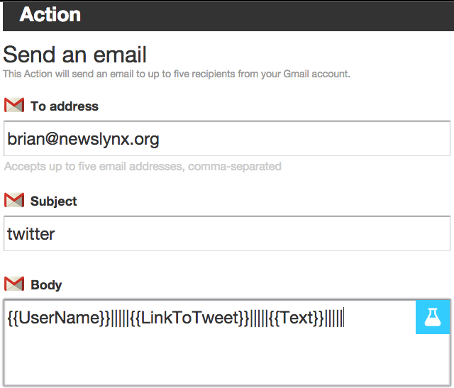
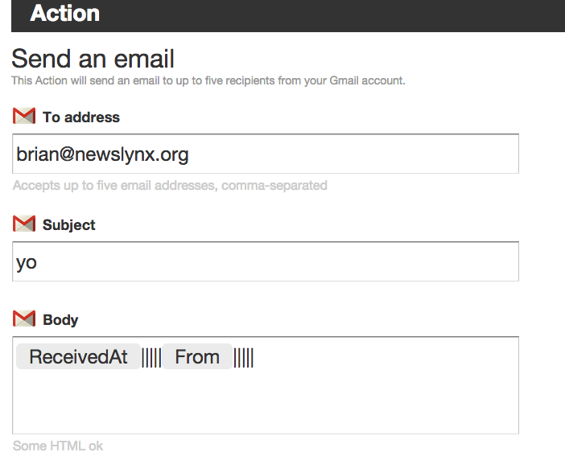

# ifttt (If That Then This)
`ifttt` is a simple package for connecting [IFTTT](http://ifttt.com) 
channels with your service via and email inbox.

## what?

[IFTTT](http://ifttt.com) provides an interface to an amazing number of services, but since they
lack their own API and have a closed submission process, it's difficult to integrate it into
your applications.  

By creating a set of transformations for routing IFTTT channels to email,
we can pass structured data to custom email-listener functions – `ifthat`
which can be routed to an arbitrary `thenthis` function that a user defines.

## installation

```
pip install ifttt
```

Our implementation is written and native python 2.7 and has no dependencies.

## examples

###  If That Then Say Tweet ...

Make a Twitter Recipe that has these email parameters (customize the address to your liking)

[](https://ifttt.com/recipes/229283-if-twitter-then-data)

```python 
from ifttt import ifthat

@ifthat('twitter', pattern = "{{UserName}}|||||{{LinkToTweet}}|||||{{Text}}|||||")
def twitter(msg):
	import os 
	os.system('tweet from {text}'.format(**msg['body']))

for msg in twitter():
	print msg
```

### If This Then Say YO

```python
from ifttt import ifthat

[](https://ifttt.com/recipes/229285-if-yo-then-data)


@ifthat('yo', pattern="{{ReceivedAt}}|||||{{From}}|||||")
def then_yo(msg):
	import os
	os.system('say yo from {from} &'.format(**msg['body']))
	return msg 
	
for msg in yo():
	print msg
```

## Configuration

export these environmental variables:

```bash
export IFTTT_USERNAME='username@domain.com'
export IFTTT_PASSWORD='password'
export IFTTT_IMAP_SERVER='mail.domain.com'
export IFTTT_IMAP_PORT=993
```

## TODO
- [ ] Delete Messages
